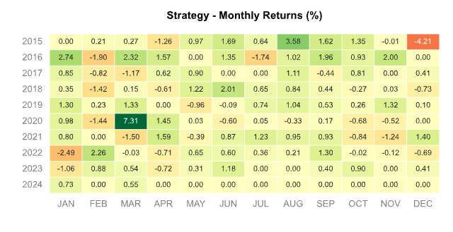

# statistical-arbitrage
 Statistical arbitrage is a quantitative finance strategy used by traders to profit from pricing inefficiencies between related financial instruments

## Explanation of Key Concepts
### 1. Augmented Dickey-Fuller (ADF) Test
The ADF Test is used to determine if a time series is stationary. Stationarity is essential when analyzing data for trading strategies as it suggests mean-reverting behavior. The `ADF_Test.ipynb` notebook walks through the process.

#### Interpretation of ADF

**p-value ≤ 0.05**: Strong evidence against the null hypothesis. Reject the null hypothesis. The data is likely stationary.
- **0.05 < p-value ≤ 0.1**: Weak evidence against the null hypothesis. Depending on the context and other factors, you might still reject the null hypothesis.
- **p-value > 0.1**: Not enough evidence against the null hypothesis. Fail to reject the null hypothesis. The data is likely non-stationary.

### 2. Cointegration Analysis
Cointegration occurs when two or more time series exhibit a stable, long-term relationship. The `cointegration_test.ipynb` notebook uses statistical tests to identify cointegrated pairs, which can inform pair trading strategies.

### 3. Backtesting
Backtesting involves simulating a trading strategy with historical data to evaluate its past performance. This process helps in understanding how a strategy would have behaved in different market conditions.

#### Metric	Strategy
| Metric              | Value    |
|---------------------|----------|
| Risk-Free Rate      | 0.0%     |
| Time in Market      | 50.0%    |
| Cumulative Return   | 49.93%   |
| CAGR﹪              | 3.13%    |
| Sharpe              | 1.01     |
| Prob. Sharpe Ratio  | 99.95%   |
| Smart Sharpe        | 0.98     |
| Sortino             | 1.73     |
| Smart Sortino       | 1.67     |
| Sortino/√2          | 1.22     |
| Smart Sortino/√2    | 1.18     |
| Omega               | 1.29     |
| Max Drawdown        | -4.41%   |
| Longest DD Days     | 399      |
| Volatility (ann.)   | 4.51%    |
| Calmar              | 0.71     |
| Skew                | 2.53     |
| Kurtosis            | 32.05    |

### Usage Examples
1. **Backtesting Strategies**: 
   - Modify parameters in the backtesting notebook to try different trading strategies.
   - Run the notebook to observe results for each modification.

2. **Cointegration Testing**:
   - Load currency pairs from the provided CSV files and run the cointegration tests to identify profitable pairs.

## Strategy Performance Report
Below is a sample performance report generated from one of the backtesting notebooks:
